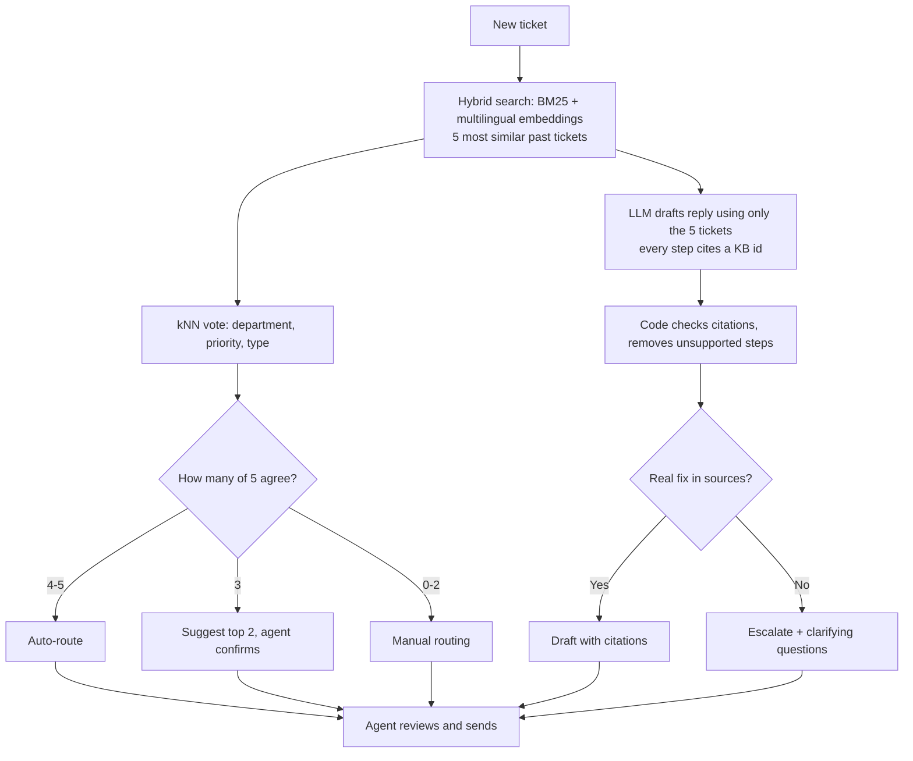

# Support Ticket Resolution Assistant

An assistant for support agents: for each new ticket it **finds similar past tickets**, **suggests routing with a confidence level**, and **drafts a reply grounded in past resolutions with citations**, escalating instead of guessing when no proven fix exists. A human agent reviews everything before it reaches the customer.

**Live demo:** https://support-ticket-assistant-ddpuqm9pyfbqxuzrefbbxt.streamlit.app
(Free hosting sleeps when unused; the first request after waking takes about a minute.)

Use Case 2 of the assignment. Every design decision, with evidence and alternatives, is in [`docs/decisions.md`](docs/decisions.md). All evaluation outputs are in [`reports/`](reports/).

---

## Key results

| Question | Finding |
|---|---|
| Is the data trustworthy? | 61,765 tickets → 48,574 usable. 8,307 exact copies and 18.2% near-copies, so I used a **group-aware split** to prevent leakage. In a hand check of 30 baseline errors, **14 dataset labels didn't fit the ticket text**. |
| How should we search? | On 1,000 unseen tickets, topic precision@5: random 12.2%, embeddings 59.5%, BM25 63.6%, **hybrid 64.1%**. Hybrid beat embeddings by 4.6 points (95% CI excludes zero). |
| How should we route? | On 200 tickets, a **free kNN vote over the 5 retrieved tickets** beat the LLM: department top-2 accuracy **77.5%** vs 41.0% (LLM alone) and 63.5% (LLM + retrieved tickets). |
| When can routing be automated? | Agreement among the 5 tickets predicts accuracy: **90% when all 5 agree, ~50% when they split**. Auto-routing at 4+ agreement covers **24% of tickets at 81% accuracy** (91% top-2). |
| Does grounding reduce made-up advice? | On 50 tickets, steps supported by sources: **59% without sources vs 100% with sources** (LLM judge); helpfulness 3.3 → 4.65 of 5. 0 of 39 steps cited a ticket that wasn't provided. |
| Can we trust the LLM judge? | No, not without checking. My blind hand check of all 39 steps found **84%**, not 100%. Every failure was the model **recommending actions the customer had already tried**. |
| Did the fix work? | A prompt rule fixed **3 of 3** bad drafts (they now escalate), at the cost of 3 of 13 good drafts also escalating. The improved judge now scores old drafts at **85%, matching my 84%**. |

## How it works



- **Retrieval:** multilingual `e5-small` embeddings (English + German in one index) fused with BM25 via reciprocal rank fusion. Knowledge base: 32,206 past tickets after removing exact copies.
- **Routing:** majority vote of the 5 retrieved tickets; the agreement count sets the confidence lane. Priority is auto-set only when all 5 agree.
- **Drafting:** Gemini (`gemini-3.5-flash-lite`, temperature 0, JSON output). Rules: use only the sources, cite them, don't recommend already-tried actions, escalate when no fix exists, reply in the customer's language.
- **New issues:** tickets unlike anything in the library get a "possible new issue" warning and manual routing; resolved tickets can be added to the library through an admin-protected API endpoint (decision D12).
- **Safety:** code-level citation validation, fallback to routing and similar tickets if the LLM fails, human review of every draft, daily request limit, ticket text not logged.

## Repository map

| Path | What |
|---|---|
| `services/assistant.py` | The core pipeline used by both the API and the app |
| `services/api.py` | FastAPI backend: `/analyse`, `/feedback`, `/metrics`, `/health` |
| `app/streamlit_app.py` | Agent screen (calls the API, or runs standalone in the cloud) |
| `scripts/` | Day-by-day analysis and evaluation scripts |
| `reports/` | Evaluation outputs and hand-check results |
| `docs/decisions.md` | Design decisions D1-D11 with evidence |
| `Dockerfile`, `start.sh` | Container running backend and frontend together |
| `data/index/` | Prebuilt search index, so the app runs without rebuilding |

## Run it locally

```bash
python -m venv .venv && source .venv/bin/activate
pip install -r requirements.txt
echo 'GEMINI_API_KEY=your-key' > .env
echo 'GEMINI_MODEL=gemini-3.5-flash-lite' >> .env

# Option 1: standalone app
streamlit run app/streamlit_app.py

# Option 2: API + app
python -m uvicorn services.api:app --port 8000          # terminal 1
API_URL=http://localhost:8000 streamlit run app/streamlit_app.py   # terminal 2
```

To rebuild the data split and index from scratch: `python scripts/day1_eda.py`, then `python scripts/day2_search.py build`.
To reproduce evaluations: `scripts/day2_eval_v2.py`, `scripts/day3_triage.py eval`, `scripts/day4_resolve.py eval`, `scripts/day5_escalation.py`, `scripts/day5_fix.py`.

## Limitations (honest list)

- **Synthetic, general-IT data**, not telecom-specific; about 30% of tickets carry telecom-relevant tags. No knowledge-base articles were added; retrieval uses past tickets only.
- **Labels are imperfect**, so exact-match scores understate quality; hand checks are by one reviewer on small samples (30-39 items).
- **High escalation (76%)** reflects the data: only about a third of historical answers actually help the customer.
- **Remaining failure modes:** steps that mix a supported and an unsupported action; dataset placeholders (`<tel_num>`, `<link>`) copied into drafts; near-duplicate tickets occupying several retrieval slots.
- **Latency:** BM25 uses pure-Python `rank_bm25` (~200 ms per query); an optimised implementation would remove most of it.
- **Small evaluation samples** for LLM steps (50-200 tickets) because of free-tier API limits.

## Scaling

Cost per ticket, what breaks first at higher volume, and the production design: see [`docs/scaling.md`](docs/scaling.md).

## Next steps

Near-duplicate removal in retrieval results, down-ranking sources with empty answers, a vector database and faster BM25 for scale, real resolution notes or KB articles to reduce escalations, and monitoring accuracy per confidence lane in production.

## Data and tools

Dataset: Tobi-Bueck/customer-support-tickets (CC BY-NC 4.0), used for non-commercial evaluation. Built with the help of AI assistants, as permitted by the brief; all evaluation numbers come from the scripts and hand checks in this repository.
